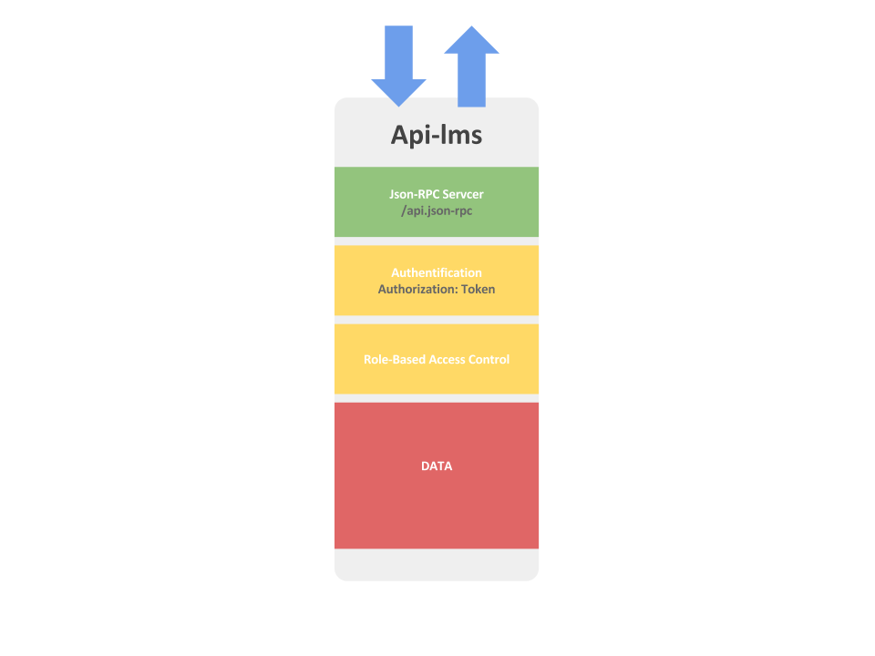

.. ApiLms documentation master file, created by
   sphinx-quickstart on Wed Jul 13 18:18:23 2016.
   You can adapt this file completely to your liking, but it should at least
   contain the root `toctree` directive.

Api-Lms documentation
=====================

==================
Indices and tables
==================

* :ref:`achi-label`.
* :ref:`jrpc-label`.
* :ref:`auth-label`.
* :ref:`rbac-label`.
* `Api Documentation Json Data <http://docs.thestudnetapi.apiary.io>` _

|
|
|
|
|
|

.. _achi-label:

Architecture logicielle
=======================

Présentation de l'architecture de l'api.

|
|
|
|

.. _jrpc-label:

Json Rpc Server
===============

*Description ( Source WIKIPEDIA )*

JSON-RPC is a remote procedure call protocol encoded in JSON. It is a very simple protocol (and very similar to XML-RPC), defining only a handful of data types and commands. JSON-RPC allows for notifications (data sent to the server that does not require a response) and for multiple calls to be sent to the server which may be answered out of order. 

See Spécification <http://www.jsonrpc.org/specification>

L'api et Accesible Via la route 

::	

	https://api.thestudnet.com/V1/api.json-rpc

|
|
|
|

.. _auth-label:

Authentification
================

la sécurité de l'autentification est basé sur un token.
Token qui est renvoie lors de la connection a l'api via methode **user.login**

::

	{
	  "result":
	    {
		  "id":3,
		  "token":"3fb217058934fbcd73da6b0b21af77a1b",
		  "created_date":"2016-07-11 14:36:13",
		  "firstname":"Christophe",
		  "lastname":"Robert",
		  "email":"crobert@thestudnet.com",
		  "roles": {
		    "3":"external"
		  },
		  "school":{
		    "id":1,
			"name":"Yale",
			"short_name":null,
			"logo":"3e09bdf9c98a706505b57f4dfa0a37d8e4783cf5",
			"background":null
		  }
		},
	  "id":"63",
	  "jsonrpc":"2.0"
	}

|

Le token Doit étre renvoyer dans le hearder html Authorization

**Headers**

::

	Content-Type:application/json
	Authorization:3e09bdf9c98a706505b57f4dfa0a37d8e4783cf5
	
|
|
|
|

.. _rbac-label:

Role-based access control
=========================

*Description ( Source WIKIPEDIA )*

Role-Based-Access-Control (RBAC) is a policy neutral access control mechanism defined around roles and privileges. The components of RBAC such as role-permissions, user-role and role-role relationships make it simple to perform user assignments. A study by NIST has demonstrated that RBAC addresses many needs of commercial and government organizations. RBAC can be used to facilitate administration of security in large organizations with hundreds of users and thousands of permissions. Although RBAC is different from MAC and DAC access control frameworks, it can enforce these policies without any complication. Its popularity is evident from the fact that many products and businesses are using it directly or indirectly.

+---------------------+--------------------+
|                     | user.login         |
+---------------------+--------------------+
| External            |        X           |
+---------------------+--------------------+

	
|
|
|
|
|
|

